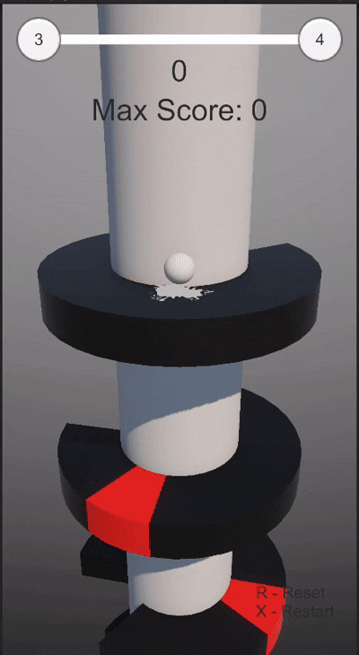
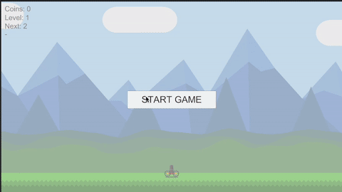

# Game Projects Repository

This repository contains small game projects created as part of learning exercises. The games are organized into directories based on their technology stack:

## Unity Games

| Project    | Preview                           | | |
| ---------- | --------------------------------- |-|-|
| Helix Jump |    | Bass Blast |  |
| Adventure  |            | | |

---

## SFML Games

| Project    | Description                                | Preview                   |
| ---------- | ------------------------------------------ | ------------------------- |
| Pacman     | —                                          |       |
| FindCouple | Find the Pair — flip cards and match pairs |  |
| Arkanoid   | —                                          |     |

---

## Pong Game (LOVE2D)

| Project    | Description                                 | Preview                   |
| ---------- | ------------------------------------------- | ------------------------- |
| Pong Clone | Classic Pong implemented in LOVE2D with Lua |  |

---

## C# Terminal Games

| Project Type        | Notes                                      |
| ------------------- | ------------------------------------------ |
| Console-based games | Includes Fighting game, Tic-Tac-Toe, Snake |

